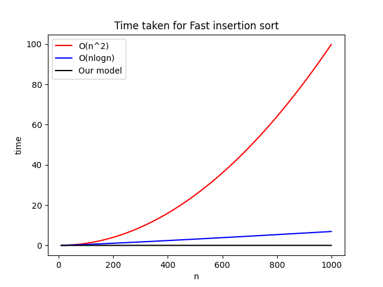

# FastSort: High-Performance Insertion Sort Variations

A Python package implementing four optimized variations of insertion sort in C++, offering significant performance improvements over pure Python implementations.

## Features

1. **Basic Insertion Sort**: The classic implementation
   - Traditional insertion sort algorithm
   - Baseline for performance comparison

2. **Binary Search Insertion Sort**: 
   - Uses binary search to optimize element placement
   - Reduces comparisons from O(n²) to O(n log n)

3. **Binary Search Pairing Sort**:
   - Processes elements in pairs
   - Uses binary search for both elements
   - Optimized for modern CPU architectures

4. **Pairing Sort**:
   - Novel approach processing elements in pairs
   - Better cache utilization
   - Improved performance on large datasets

## Installation

### Requirements

- Python 3.7 or higher
- numpy >= 1.20.0
- pybind11 >= 2.10.0
- C++11 compatible compiler
- CMake (for building from source)

### Prerequisites

#### Ubuntu/Linux:
```bash
# Install required system packages
sudo apt-get update
sudo apt-get install python3-dev build-essential cmake

# Optional: Install pip if not already installed
sudo apt-get install python3-pip
```

#### Windows:
1. Install Python 3.7 or higher from [python.org](https://www.python.org/downloads/)
2. Install Visual Studio Build Tools 2019 or newer with:
   - C++ Desktop Development workload
   - Windows 10/11 SDK
   - MSVC v142 or newer

### Option 1: Install from GitHub

#### Ubuntu/Linux:
```bash
# Create and activate virtual environment
python3 -m venv .venv
source .venv/bin/activate

# Install the package
pip install git+https://github.com/Shubhajeetgithub/Fast_InsertionSort.git
```

#### Windows:
```powershell
# Create and activate virtual environment
python -m venv .venv
.venv\Scripts\activate

# Install the package
pip install git+https://github.com/Shubhajeetgithub/Fast_InsertionSort.git
```

Now create a file `test.py` and write this
```py
import numpy as np
from fastsort import FastInsertionSort
from matplotlib import pyplot as plt


n = np.arange(10, 1000) #x-axis
y1 = n*n / 10000  # scale down to match time units
y2 = n * np.log(n) / 1000  # scale down to match time units
y = []
for num in n:
    arr = np.random.randint(0, 1000, num).tolist()
    sorter = FastInsertionSort(arr)
    _, time_taken = sorter.binarySearchPairing_insertionSort()
    y.append(time_taken)

plt.plot(n, y1, color='red', label="O(n^2)")
plt.plot(n, y2, color='blue', label="O(nlogn)")
plt.plot(n, y, color='black', label="Our model")
plt.title("Time taken for Fast insertion sort")
plt.xlabel("n")
plt.ylabel("time")
plt.legend()
plt.show()
```
In VSCode, press `CTRL+SHIFT+P`, Python>Select Interpreter, and click Virtual environment option. Next install matplotlib in the virtal environment using pip install matplotlib. Then run 
```bash
source .venv/bin/activate
.venv/bin/python test.py
```


### Option 2: Install from Source

#### Ubuntu/Linux:
```bash
# Clone the repository
git clone https://github.com/Shubhajeetgithub/Fast_InsertionSort.git
cd Fast_InsertionSort

# Create and activate virtual environment
python3 -m venv .venv
source .venv/bin/activate

# Install dependencies
pip install numpy pybind11

# Install the package
pip install .
```

#### Windows:
```powershell
# Clone the repository
git clone https://github.com/Shubhajeetgithub/Fast_InsertionSort.git
cd Fast_InsertionSort

# Create and activate virtual environment
python -m venv .venv
.venv\Scripts\activate

# Install dependencies
pip install numpy pybind11

# Install the package
pip install .
```

### Troubleshooting Installation

#### Ubuntu/Linux:
If you encounter build errors:
```bash
# Ensure all build dependencies are installed
sudo apt-get install python3-dev build-essential cmake

# Clean previous build artifacts
rm -rf build/ dist/ *.egg-info

# Reinstall
pip install .
```

#### Windows:
If you encounter "Microsoft Visual C++ 14.0 or greater is required":
1. Download Visual Studio Build Tools from [visualstudio.microsoft.com](https://visualstudio.microsoft.com/visual-cpp-build-tools/)
2. Install with "Desktop development with C++" workload
3. Restart your terminal and try installation again

## Usage

```python
import numpy as np
from fastsort import FastInsertionSort

# Create a random array to sort
arr = np.random.randint(0, 1000, 1000).tolist()

# Initialize the sorter
sorter = FastInsertionSort(arr)

# Use any of the sorting methods
sorted_arr, time_taken = sorter.basic_insertionSort()
sorted_arr, time_taken = sorter.binarySearch_insertionSort()
sorted_arr, time_taken = sorter.binarySearchPairing_insertionSort()
sorted_arr, time_taken = sorter.pairing_insertionSort()
```

Each sorting method returns a tuple containing:
- The sorted array
- The time taken to sort (in seconds)

## Algorithm Details

### Basic Insertion Sort
- Traditional insertion sort implementation
- Time Complexity: O(n²)
- Space Complexity: O(1)

### Binary Search Insertion Sort
- Uses binary search to find the insertion position
- Reduces comparisons but not swaps
- Time Complexity: O(n log n) for comparisons, O(n²) for swaps
- Space Complexity: O(1)

### Binary Search Pairing Sort
- Processes elements in pairs
- Uses binary search for both elements of the pair
- Time Complexity: O(n log n) for comparisons, O(n²) for swaps
- Space Complexity: O(1)

### Pairing Sort
- Processes elements in pairs
- Optimizes insertions by handling two elements at once
- Time Complexity: O(n²)
- Space Complexity: O(1)


## Performance

The performance of each algorithm varies depending on:
- Input size
- Initial order of elements
- Hardware characteristics

Generally:
- Binary search variants perform fewer comparisons
- Pairing variants can be faster on modern hardware due to better cache utilization
- For large arrays, binary search variants typically provide better performance

## Running Tests

To run the test suite:

```bash
# Ensure you're in your virtual environment
source .venv/bin/activate  # On Windows: .venv\Scripts\activate

# Install test dependencies
pip install pytest

# Run tests
pytest tests/test_sort.py -v
```

## Using the Package in Other Projects

There are two ways to use this package in your other projects:

### Development Installation

For developers who want to modify the package while using it:

#### Ubuntu/Linux:
```bash
# Clone and navigate to the repository
git clone https://github.com/Shubhajeetgithub/Fast_InsertionSort.git
cd Fast_InsertionSort

# Create and activate virtual environment
python3 -m venv .venv
source .venv/bin/activate

# Install in development mode
pip install -e .
```

#### Windows:
```powershell
# Clone and navigate to the repository
git clone https://github.com/Shubhajeetgithub/Fast_InsertionSort.git
cd Fast_InsertionSort

# Create and activate virtual environment
python -m venv .venv
.venv\Scripts\activate

# Install in development mode
pip install -e .
```

## Quick Start

Here's a comprehensive example showing how to use the package:

```python
import numpy as np
from fastsort import FastInsertionSort

def benchmark_sorting_algorithms(size=1000, max_value=1000):
    # Create sample data
    arr = np.random.randint(0, max_value, size).tolist()
    
    # Initialize sorter
    sorter = FastInsertionSort(arr)
    
    # Dictionary to store results
    results = {}
    
    # Test all sorting methods
    results['Basic'] = sorter.basic_insertionSort()
    results['Binary Search'] = sorter.binarySearch_insertionSort()
    results['Binary Search Pairing'] = sorter.binarySearchPairing_insertionSort()
    results['Pairing'] = sorter.pairing_insertionSort()
    
    # Verify sorting and print results
    for name, (sorted_arr, time_taken) in results.items():
        is_sorted = all(sorted_arr[i] <= sorted_arr[i+1] 
                       for i in range(len(sorted_arr)-1))
        print(f"{name:20} Time: {time_taken:8.6f} seconds  "
              f"{'✓' if is_sorted else '✗'}")

if __name__ == "__main__":
    print("Testing with array size 1000:")
    benchmark_sorting_algorithms(1000)
    
    print("\nTesting with array size 10000:")
    benchmark_sorting_algorithms(10000)
```

This script will:
1. Create random arrays of different sizes
2. Sort them using all available methods
3. Verify the sorting is correct
4. Print timing results for each algorithm

### Example Benchmark Script

Here's a complete example that benchmarks all sorting algorithms:

```python
import numpy as np
from fastsort import FastInsertionSort
import time

def benchmark_sorts(size=1000):
    # Generate random data
    arr = np.random.randint(0, 1000, size).tolist()
    sorter = FastInsertionSort(arr)
    
    # Test all algorithms
    algorithms = [
        ('Basic', sorter.basic_insertionSort),
        ('Binary Search', sorter.binarySearch_insertionSort),
        ('Binary Search Pairing', sorter.binarySearchPairing_insertionSort),
        ('Pairing', sorter.pairing_insertionSort)
    ]
    
    for name, algorithm in algorithms:
        sorted_arr, sort_time = algorithm()
        print(f"{name} Sort Time: {sort_time:.6f} seconds")

if __name__ == "__main__":
    print("Benchmarking with array size 10000:")
    benchmark_sorts(10000)
```

## License

This project is licensed under the MIT License - see the LICENSE file for details.